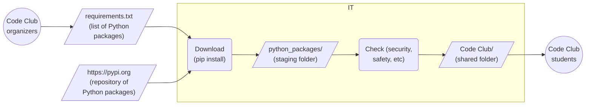

# codeclub-dws

## Introduction

This page and repository proposes a simple process for downloading Python packages to be used by the CodeClub students.

The process is:
1. The CodeClub organizers maintain a list of Python packages they want to use.
2. The IT Team downloads the packages in the list (script provided).
3. The IT Team reviews the downloaded packages (security checks, content, etc).
4. The IT Team installs the downloaded packages into a location (eg local folder or network drive) accessible by all the CodeClub students.

The process is incremental and can easily be run each time the list of Python packages is modified.



## Details

### [requirements.txt](requirements.txt)

Contains the list of the Python packages to download from [PyPI](https://pypi.org) (Python Package Index). 

For example:

```
# A package to develop text-based games.
# Doc: https://adventurelib.readthedocs.io/
adventurelib

# A package to develop GUI apps and games.
# Doc: https://lawsie.github.io/guizero/
guizero[images]

# A package to convert numbers to words and much more.
# Doc: https://inflect.readthedocs.io/
inflect

# A package to develop GUI games (wrapper for PyGame).
# Doc: https://pygame-zero.readthedocs.io/
pgzero

# A package to render text in ASCII art fonts.
# Doc: https://pypi.org/project/pyfiglet/
# Doc: https://www.tutorialspoint.com/ascii-art-using-python-pyfiglet-module
pyfiglet

# A package to write unit tests.
# Doc: https://docs.pytest.org/
pytest

# A package to convert text to speech.
# Doc: https://pyttsx3.readthedocs.io/
pyttsx3
```

It is possible to specify a version (exact, minimum, etc) for each package but we do not need this for now. 

### [download.bat](download.bat) / [download.sh](download.sh)

Reads `requirements.txt` and downloads all the packages (including their dependencies) into `./python-packages/` (created automatically). 

Uses `pip` which should be included in any recent Python distribution.

```bash
pip install --requirement=./requirements.txt --target=./python-packages --upgrade
```

Rerunning the script will upgrade the existing packages and download the additional ones.
  
### python-packages/

Contains the downloaded Python packages as specified in `requirements.txt` (including their dependencies). Managed by `download.bat`/`download.sh`.

```bash
$ tree python-packages/ -d -L 1
python-packages/
|-- PIL
|-- Pillow-10.1.0.dist-info
|-- __pycache__
|-- _pytest
|-- adodbapi
...
|-- tomli-2.0.1.dist-info
|-- typing_extensions-4.8.0.dist-info
|-- win32
|-- win32com
`-- win32comext

54 directories
```

This folder must be accessible (read-only) by all the students attending CodeClub. This could be through:

1. **local copy** on each PC in the IT room where CodeClub is held
2. **network drive** accessible from each PC in the IT room where CodeClub is held

A priori #2 should be easier to manage.

### [codeclub_dws.py](codeclub_dws.py)

A convenience Python file that adds the location of `python-packages/` to `PYTHONPATH` which is the list of 
folders where a Python program can import packages from.

```python
import sys

# Path to the folder (local or network) containing the Python packages.
PATH_TO_PYTHON_PACKAGES = TBD  # TODO: eg "c:\\CodeClub\\python-packages" or "\\\\CodeClub\\python-packages"

sys.path.append(PATH_TO_PYTHON_PACKAGES)
```

The students would copy this file into their project folder and import it into their main program (see hereunder for an example).

### [demo-adventurelib.py](demo-adventurelib.py)

A Python demo program that uses some downloaded Python packages. 

```python
# Add ".../CodeClub/python-packages/" to PYTHONPATH.
import codeclub_dws

# Import the required downloaded packages.
from adventurelib import *
from printy import inputy
from pyfiglet import print_figlet

...
```
